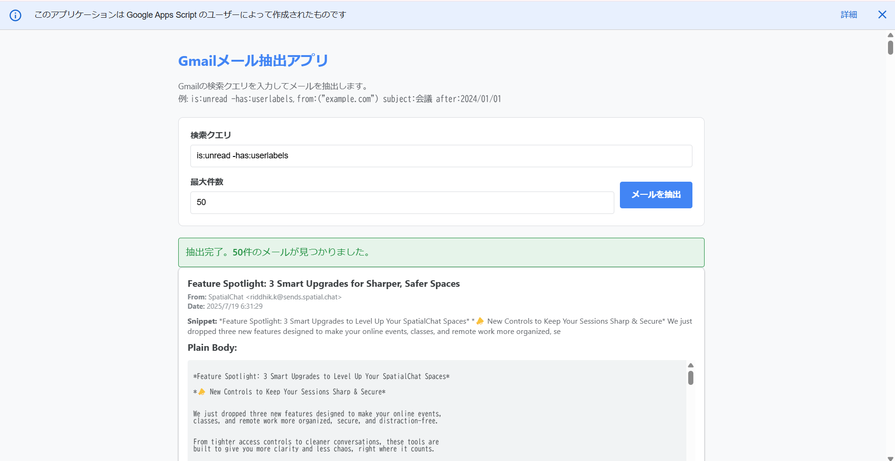

<details>
<summary>日本語 (Japanese)</summary>

# Gmail Data Extractor GAS App

## 1. 概要 (Overview)

本プロジェクトは、Google Apps Script (GAS) を利用し、ユーザーのGmailから指定された検索クエリに基づいてメールデータを抽出する汎用的なWebアプリケーションです。

Web UIを通じて手動で抽出を実行できるほか、Dockerを活用することで、ローカル開発環境をクリーンに保ち、再現性を高めています。



> **Note:** 上記のスクリーンショットを表示するには、このリポジトリに`.assets/screenshot.png`という名前で画像を配置してください。

## 2. 主な機能 (Features)

-   **Web UIによるメール抽出:** ブラウザからGmailの検索クエリと最大取得件数を指定して、メールデータを抽出・表示できます。
-   **柔軟な検索:** Gmailがサポートする全ての検索演算子（`from:`, `subject:`, `is:unread`など）を利用可能です。
-   **モダンな開発環境:** Dockerと`clasp` (The Apps Script CLI) を利用し、ローカルでの開発とデプロイを効率化します。
-   **オープンソース:** MITライセンスのもとで公開されており、自由に改変・利用できます。

## 3. 開発環境のセットアップ (Development Setup)

本プロジェクトでは、開発環境の構築にDockerを使用します。ホストマシンにNode.jsや`clasp`を直接インストールする必要はありません。

### 前提条件 (Prerequisites)

-   [Docker Desktop](https://www.docker.com/products/docker-desktop/) または Docker Engine がインストールされていること。
-   Googleアカウントを持っていること。

### セットアップ手順 (Setup Steps)

1.  **リポジトリをクローン:**
    ```bash
    git clone [https://github.com/yutaro89/Gmail-Data-Extractor-GAS-App.git](https://github.com/yutaro89/Gmail-Data-Extractor-GAS-App.git)
    cd Gmail-Data-Extractor-GAS-App
    ```

2.  **Dockerイメージの構築とコンテナの起動:**
    ```bash
    docker compose up -d --build
    ```

3.  **`clasp`でGoogleにログイン (重要):**
    Dockerコンテナ内からのログインは、2つのターミナルを使った特殊な手順が必要です。

    **【ターミナル ①】 - `clasp login` を実行する**
    a. コンテナのシェルに接続します。
    ```bash
    docker compose exec clasp-dev /bin/sh
    ```
    b. コンテナ内で `clasp login` を実行します。
    ```bash
    # /app # のようなプロンプトで実行
    clasp login
    ```
    c. `Authorize clasp...` の後に表示されるURLをコピーします。
    d. ホストPCのブラウザでURLを開き、Googleアカウントでログインして権限を許可します。
    e. リダイレクト後に表示されるエラーページのURL（`http://localhost:xxxx/?code=...`）をすべてコピーします。

    **【ターミナル ②】 - 認証コードをコンテナに渡す**
    a. PCで**新しいターミナル**を開きます。
    b. 以下のコマンドを実行します。`'コピーしたURL'` の部分を、先ほどコピーしたURLに置き換えてください。
    ```bash
    docker compose exec clasp-dev curl 'コピーしたURL'
    ```
    c. ターミナル①で `Logged in successfully.` と表示されればログイン完了です。

4.  **GASプロジェクトの作成と紐付け:**
    ブラウザで[GASプロジェクトを新規作成](https://script.google.com/home/my)し、「プロジェクトの設定」から**スクリプトID**をコピーします。
    **ターミナル①**に戻り、以下のコマンドでローカル環境と紐付けます。
    ```bash
    clasp clone "YOUR_SCRIPT_ID" --rootDir ./src
    ```

5.  **依存パッケージのインストール:**
    **ターミナル①**で、プロジェクトに必要なパッケージをインストールします。
    ```bash
    npm install
    ```

6.  **Apps Script APIの有効化 (初回のみ):**
    [設定ページ](https://script.google.com/home/usersettings)にアクセスし、「Google Apps Script API」を「オン」に切り替えます。

7.  **ソースコードをGASプロジェクトにプッシュ:**
    **ターミナル①**で以下のコマンドを実行します。
    ```bash
    clasp push
    ```

## 4. デプロイと実行 (Deployment & Usage)

1.  **Webアプリとしてデプロイ:**
    [GASエディタ](https://script.google.com/home/my)でプロジェクトを開き、右上の「デプロイ」>「新しいデプロイ」を選択します。
    -   **種類を選択:** 歯車アイコンをクリックし、「ウェブアプリ」を選択します。
    -   **次のユーザーとして実行:** `自分`
    -   **アクセスできるユーザー:** `自分のみ`
    -   「デプロイ」をクリックし、表示された**ウェブアプリURL**をコピーします。

2.  **Webアプリへのアクセスと権限の許可:**
    コピーしたURLに初めてアクセスすると警告画面が表示されますが、「詳細」 > 「(アプリ名)に移動（安全ではないページ）」と進み、権限を「許可」してください。

## 5. テスト (Testing)

このプロジェクトには、JestによるユニットテストとPlaywrightによるE2Eテストが用意されています。

詳細なテストの実行方法については、`tests`ディレクトリ内の以下のガイドを参照してください。
-   **[テスト実施ガイド](./tests/TESTING_GUIDE.md)**

また、手動でのリグレッションテストについては、以下のドキュメントを参照してください。
-   **[手動テストケース](./TESTING.md)**

## 6. プロジェクト構成 (Project Structure)

/
├── .github/              # GitHub Actions ワークフロー
│   └── workflows/
│       └── lint-check.yml
├── .clasp.json           # clasp設定ファイル
├── .eslintrc.json        # ESLint設定ファイル
├── .gitignore            # Gitの無視ファイル設定
├── .prettierrc.json      # Prettier設定ファイル
├── appsscript.json       # GASマニフェストファイル
├── Dockerfile            # 開発用のDockerfile
├── docker-compose.yml    # 開発用のdocker-compose
├── LICENSE               # プロジェクトライセンス
├── CONTRIBUTING.md       # コントリビュートガイド
├── package.json          # Node.jsプロジェクト定義
├── README.md             # このファイル
├── TESTING.md            # 手動テストケース
├── src/                  # ソースコードディレクトリ
│   ├── Code.gs           # サーバーサイドロジック(Apps Script)
│   └── Index.html        # Web UI (HTML/CSS/JS)
└── tests/                # テスト関連ディレクトリ
├── Dockerfile.e2e    # E2Eテスト専用のDockerfile
├── TESTING_GUIDE.md  # テスト実施の詳細ガイド
├── docker-compose.e2e.yml
├── playwright.config.js
├── e2e/
│   ├── app.spec.js
│   └── setup/
│       └── auth.setup.js
└── unit/
└── Code.test.js

## 7. コードスタイルのチェック (Code Style)

本プロジェクトでは、コードの一貫性を保つためにESLint（Linter）とPrettier（Formatter）を導入しています。

-   **コードスタイルのチェック:**
    ```bash
    npm run lint
    ```
-   **コードの自動整形:**
    ```bash
    npm run format
    ```
コミットやPull Requestの前に、これらのコマンドでコードをクリーンな状態に保つことを推奨します。

## 8. ライセンス (License)

このプロジェクトは [MIT License](LICENSE) のもとで公開されています。

</details>

<details>
<summary>English</summary>

# Gmail Data Extractor GAS App

## 1. Overview

This project is a versatile web application built with Google Apps Script (GAS) that extracts email data from a user's Gmail account based on a specified search query. It allows manual extraction through a web UI and utilizes Docker to maintain a clean and reproducible local development environment.


> **Note:** To display the screenshot above, place an image named `screenshot.png` in the `.assets/` directory of this repository.

## 2. Features

-   **Email Extraction via Web UI:** Specify a Gmail search query and the maximum number of results to extract and display email data directly from your browser.
-   **Flexible Search:** Supports all search operators provided by Gmail (e.g., `from:`, `subject:`, `is:unread`).
-   **Modern Development Environment:** Streamlines local development and deployment using Docker and `clasp` (The Apps Script CLI).
-   **Open Source:** Published under the MIT License, allowing you to freely modify and use the code.

## 3. Development Setup

This project uses Docker to build the development environment. You do not need to install Node.js or `clasp` directly on your host machine.

### Prerequisites

-   [Docker Desktop](https://www.docker.com/products/docker-desktop/) or Docker Engine must be installed.
-   A Google Account.

### Setup Steps

1.  **Clone the repository:**
    ```bash
    git clone [https://github.com/yutaro89/Gmail-Data-Extractor-GAS-App.git](https://github.com/yutaro89/Gmail-Data-Extractor-GAS-App.git)
    cd Gmail-Data-Extractor-GAS-App
    ```

2.  **Build the Docker image and start the container:**
    ```bash
    docker compose up -d --build
    ```

3.  **Log in to Google with `clasp` (Important):**
    Logging in from within a Docker container requires a special procedure using two terminals.

    **[Terminal ①] - Run `clasp login`**
    a. Connect to the container's shell:
    ```bash
    docker compose exec clasp-dev /bin/sh
    ```
    b. Run `clasp login` inside the container:
    ```bash
    # Run this at a prompt like /app #
    clasp login
    ```
    c. Copy the URL that appears after `Authorize clasp...`.
    d. Open this URL in your host browser, log in to your Google account, and grant permissions.
    e. Copy the entire URL from the error page you are redirected to (it will look like `http://localhost:xxxx/?code=...`).

    **[Terminal ②] - Pass the authorization code**
    a. Open a **new terminal** on your computer.
    b. Run the following command, replacing `'COPIED_URL'` with the URL you just copied.
    ```bash
    docker compose exec clasp-dev curl 'COPIED_URL'
    ```
    c. You should see `Logged in successfully.` in Terminal ①.

4.  **Create and link the GAS project:**
    Create a new GAS project in your browser, and copy the Script ID from "Project Settings". Return to **Terminal ①** and run the following command to link it.
    ```bash
    clasp clone "YOUR_SCRIPT_ID" --rootDir ./src
    ```

5.  **Install Dependencies:**
    In **Terminal ①**, install the packages required for the project.
    ```bash
    npm install
    ```

6.  **Enable the Apps Script API (First time only):**
    Visit the [settings page](https://script.google.com/home/usersettings) and turn the "Google Apps Script API" switch "On".

7.  **Push the source code to the GAS project:**
    In **Terminal ①**, run the following command:
    ```bash
    clasp push
    ```

## 4. Deployment & Usage

1.  **Deploy as a Web App:**
    Open your project in the [GAS editor](https://script.google.com/home/my) and click "Deploy" > "New deployment".
    -   **Select type:** Click the gear icon and select "Web app".
    -   **Execute as:** Me
    -   **Who has access:** Only myself
    -   Click "Deploy" and copy the **Web app URL**.

2.  **Access the Web App and Grant Permissions:**
    When you first visit the URL, you will see a warning screen. Click "Advanced" -> "Go to [App Name] (unsafe)" and then "Allow" to grant permissions.

## 5. Testing

This project includes unit tests with Jest and E2E tests with Playwright.

For detailed instructions on how to run the tests, please refer to the following guide in the `tests` directory.
-   **[Testing Guide](./tests/TESTING_GUIDE.md)**

For manual regression testing, please refer to the document below.
-   **[Manual Test Cases](./TESTING.md)**

## 6. Project Structure

/
├── .github/              # GitHub Actions workflows
│   └── workflows/
│       └── lint-check.yml
├── .clasp.json           # clasp configuration file
├── .eslintrc.json        # ESLint configuration file
├── .gitignore            # Files for Git to ignore
├── .prettierrc.json      # Prettier configuration file
├── appsscript.json       # GAS manifest file
├── Dockerfile            # Dockerfile for development
├── docker-compose.yml    # Docker Compose for development
├── LICENSE               # Project license
├── CONTRIBUTING.md       # Contribution guidelines
├── package.json          # Node.js project definition
├── README.md             # This file
├── TESTING.md            # Manual test cases
├── src/                  # Source code directory
│   ├── Code.gs           # Server-side logic (Apps Script)
│   └── Index.html        # Web UI (HTML/CSS/JS)
└── tests/                # Directory for all tests
├── Dockerfile.e2e    # Dockerfile for E2E tests
├── TESTING_GUIDE.md  # Detailed guide for running tests
├── docker-compose.e2e.yml
├── playwright.config.js
├── e2e/
│   ├── app.spec.js
│   └── setup/
│       └── auth.setup.js
└── unit/
└── Code.test.js

## 7. Code Style

This project uses ESLint and Prettier to maintain a consistent code style.

-   **Check for linting errors:**
    ```bash
    npm run lint
    ```
-   **Format code automatically:**
    ```bash
    npm run format
    ```
It is recommended to keep the code clean with these commands before committing or creating a pull request.

## 8. License

This project is licensed under the [MIT License](LICENSE).

</details>